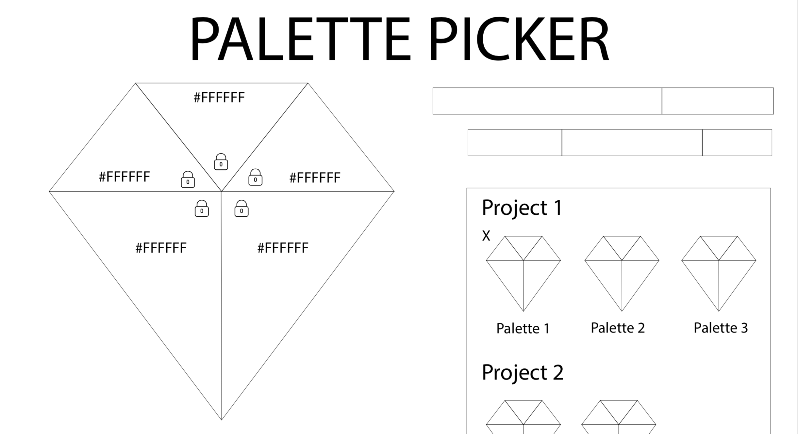

# Palette Picker

[Project](http://frontend.turing.io/projects/palette-picker.html) that allows users to generate color palettes and save them for future use. Back-end built using Express, knex, and PostgreSQL. Front-end built using jQuery.

Launch Application --> [Here](https://palette-picker-laura-whitaker.herokuapp.com/)

## Wireframe

## Result

